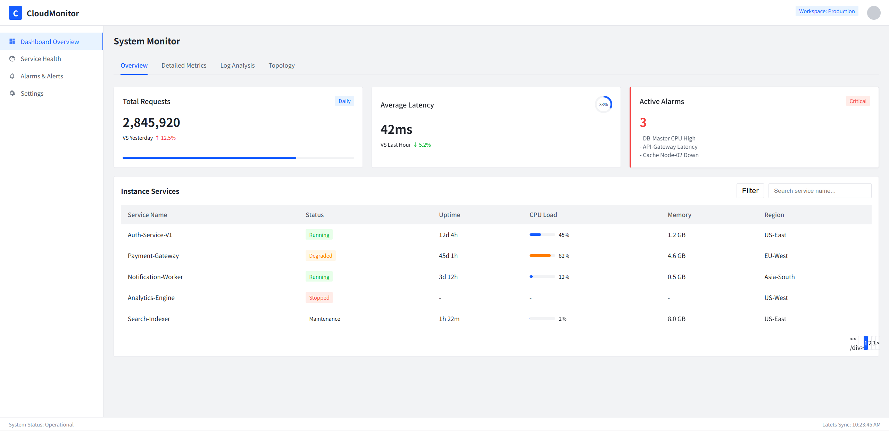
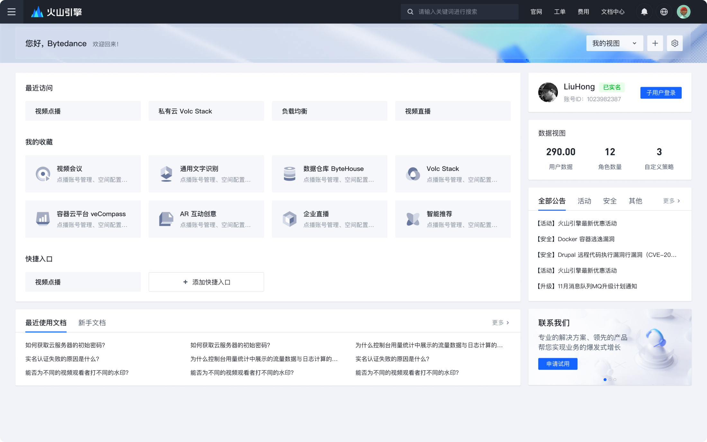

# experiment log

## experiment 1：基于设计组件生成

- 规范：[arco.design](https://arco.design/)
- 设计组件：figma components -> pencil components （组件化快捷键：ctrl + alt + k）

### experiment 1.1 D2C(HTML)生成
直接指令，大模型默认会用HTML生成
- 提示词: `Design a 云服务监控看板控制台页面 using components in@arcoui/components ，refer to styule @design style.pen 采用“顶部导航栏+左侧侧边栏+中间主内容区+底部状态栏”自适应布局，包含横向联动页签、三类圆角卡片（总览/指标详情/告警）、带排序筛选分页的标准表格、线性/环形进度条及四类差异化tag标签，遵循指定样式规格与交互逻辑，适配运维场景，实现监控指标直观展示、异常快速定位，支持后续扩展。`

- 提示词：`@arcoui/components  @design style.pen 保持风格和字体符合规范 ，使用arcoui组件，继续补充Detailed Metrics、Log Analysis、Topology页面的结果 @cloud_monitor_dashboard.html`
- 提示词：`继续，基于场景模拟生成Detailed Metrics、Log Analysis、Topology页签和侧边导航菜单内的内容，组件仍然得从这里选择 @arcoui/components `

### experiment 1.2 D2D(Pencil)生成
要求模型通过Pencil绘制
- 提示词: `Design a 云服务监控看板控制台页面 in Pencil (给到.pen文件) using components in@arcoui/components ，refer to styule @design style.pen 采用“顶部导航栏+左侧侧边栏+中间主内容区+底部状态栏”自适应布局，包含横向联动页签、三类圆角卡片（总览/指标详情/告警）、带排序筛选分页的标准表格、线性/环形进度条及四类差异化tag标签，遵循指定样式规格与交互逻辑，适配运维场景，实现监控指标直观展示、异常快速定位，支持后续扩展。`

### experiment 1.3 D2D(Pencil)生成 w/o COM&STYLE
要求模型通过Pencil绘制
- 提示词: `Design a 云服务监控看板控制台页面 in Pencil 采用“顶部导航栏+左侧侧边栏+中间主内容区+底部状态栏”自适应布局，包含横向联动页签、三类圆角卡片（总览/指标详情/告警）、带排序筛选分页的标准表格、线性/环形进度条及四类差异化tag标签，遵循指定样式规格与交互逻辑，适配运维场景，实现监控指标直观展示、异常快速定位，支持后续扩展。`

### experiment 1.4 D2D(Pencil)生成 
要求模型通过Pencil绘制
- 提示词: `Design a 云服务监控看板控制台页面 in Pencil (给到.pen文件) using components in@arcoui/components ，refer to styule @design style.pen 采用“顶部导航栏+左侧侧边栏+中间主内容区+底部状态栏”自适应布局，包含横向联动页签、三类圆角卡片（总览/指标详情/告警）、带排序筛选分页的标准表格、线性/环形进度条及四类差异化tag标签，遵循指定样式规格与交互逻辑，适配运维场景，实现监控指标直观展示、异常快速定位，支持后续扩展。`

### exp 1.5 D2D (Pencil) 生成
Design a B端云服务控制台概览页 using components in @arcoui/components  ，refer to style @arcoui/design style.pen  。
## 组件使用指引
1. 从给定的组件目录中读取可复用的组件
2. 因为pencil无法跨越文件ref组件，你需要先在目标.pen文件中重新构造需要引用的组件，然后在ref目标组件。注意重新构造组件时不要修改原始组件。
3. 在生成过程中，你必须要优先满足组件的规范，使用ref引用组件库的方式来设计页面。只有当已有组件无法满足用户需求时，你可以通过descendants修改组件的属性或者重新设计新的组件。

## 设计需求：“
B端云服务控制台概览页（Dashboard）。整体风格采用现代简约的“字节跳动（Volcano Engine）”设计语言：大留白、浅灰背景、高对比度的蓝色主色调，以及清晰的栅格化布局。
1. 导航与顶部（Header）
顶部栏： 深蓝色背景，左侧为“火山引擎”Logo，中间是全局搜索框，右侧包含文档中心、费用、通知中心及用户头像。

欢迎区块： 浅蓝色渐变背景，左侧显示“您好，Bytedance”，右侧提供视图切换下拉框和快捷设置按钮。

2. 左侧主视图（Main Content）
最近访问（Recent Visits）： 四个简洁的文字卡片，平铺排列，用于快速跳转高频业务（如视频点播、私有云等）。

我的收藏（My Favorites）： 2x4 布局的卡片阵列。每个卡片包含：

彩色线性图标（代表不同产品线，如 ByteHouse, Volc Stack）。

加粗的产品标题。

浅灰色的功能简述文案。

快捷入口（Quick Access）： 包含已有标签和“+ 添加快捷入口”的交互按钮。

文档区域（Documentation）： 底部双栏布局，展示“最近使用文档”和“新手文档”列表，采用三列排版，方便快速查阅 FAQ。

3. 右侧侧边栏（Sidebar）
用户信息卡： 展示用户姓名（LiuHong）、已实名状态标签、账号 ID，以及显眼的“子用户登录”蓝色按钮。

数据概览： 极简数字统计，展示用户数据、角色数量、自定义策略等核心指标。

公告通知： 分类标签式（全部、活动、安全等）的列表，展示最新的系统升级或优惠信息。

联系我们： 底部引导卡片，包含背景图和“申请试用”的 CTA（Call to Action）按钮。

### experiment 1.2 D2C(React)生成

## experiment 2

### experiment 2.1

### experiment 2.2